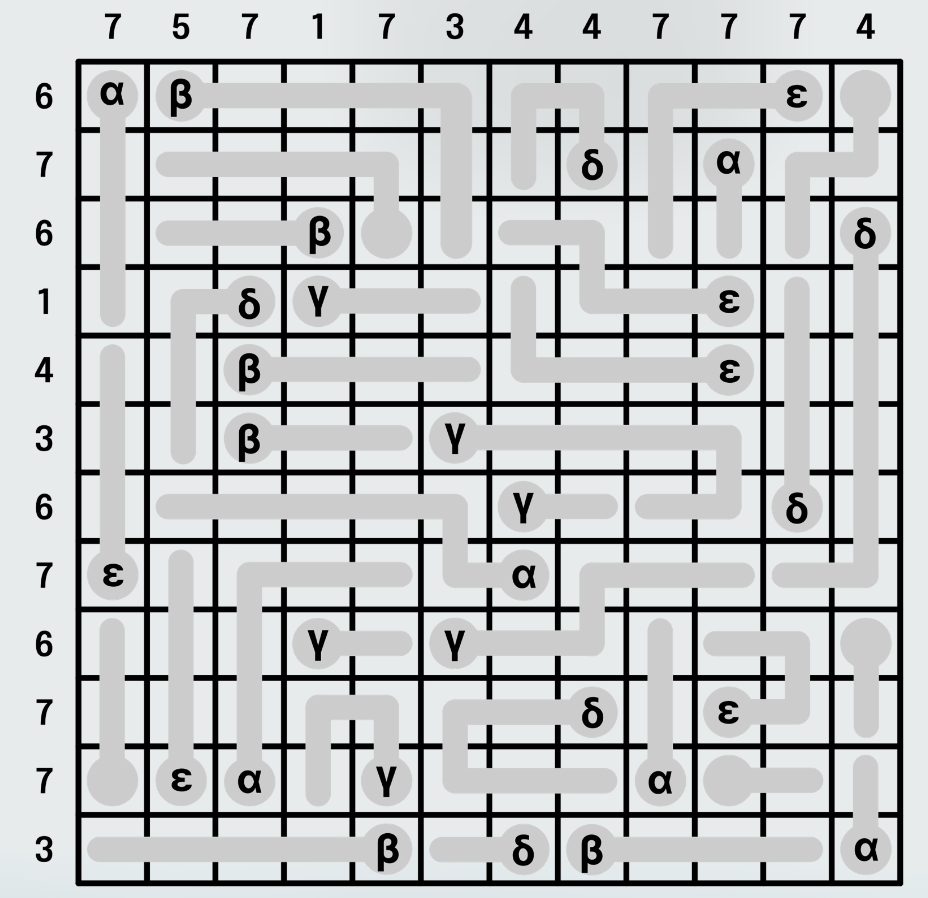

# Wild_Thermometers
 Vamos a resolver el puzzle 19 de la convocatoria de Hack The Galaxy by Rapid.
El reto es el siguiente:
> En la cuadrícula, rellena los espacios de los termómetros desde el extremo del bulbo hacia el extremo opuesto. Puedes detenerte en cualquier punto al rellenar un termómetro, incluso sin rellenar nada (ni siquiera el bulbo), pero no se pueden saltar espacios.
Los números fuera de la cuadrícula indican cuántos espacios en esa fila o columna estarán rellenos al final.\
Cuando termines, suma los valores (número de espacios rellenos) de los termómetros marcados con alfa, luego convierte esa suma a una letra (1 = A, 2 = B, 3 = C, etc.).\
Después, haz lo mismo con los termómetros marcados con beta, gamma, delta y épsilon, en ese orden.
El resultado forma una palabra de 5 letras.

 

 Voy a resolverlo utilizando algoritmos genéticos
